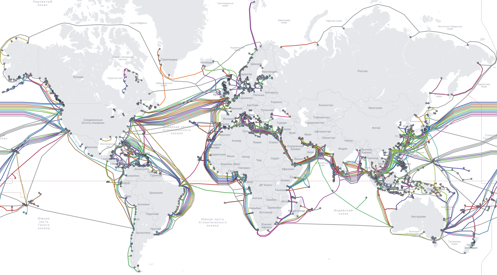
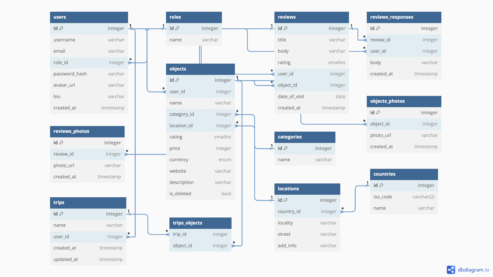
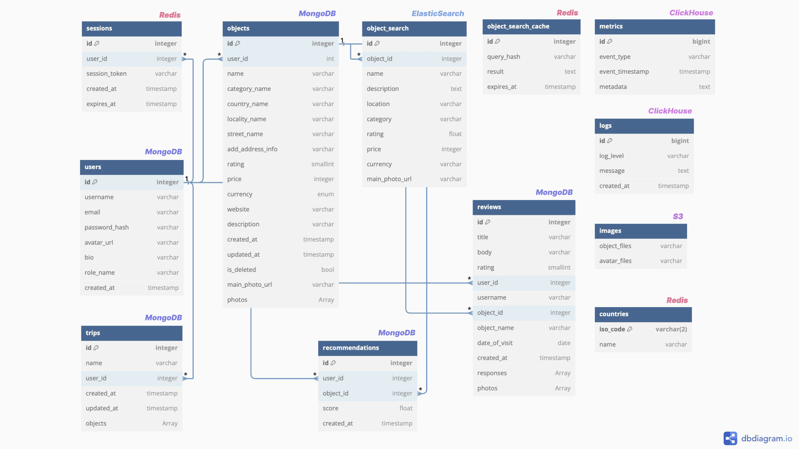

# Проектирование высоконагруженной системы на примере сервиса для путешествий Tripadvisor
Курсовая работа по предмету "Проектирование высоконагруженных систем" в образовательном центре ВК в МГТУ им. Баумана.

## Содержание

[1. Тема, аудитория, функционал](#1-тема-аудитория-функционал)

[2. Расчет нагрузки](#2-расчет-нагрузки)

[3. Глобальная балансировка нагрузки](#3-глобальная-балансировка-нагрузки)

[4. Локальная балансировка нагрузки](#4-локальная-балансировка-нагрузки)

[5. Логическая схема БД](#5-логическая-схема-бд)

[6. Физическая схема БД](#6-физическая-схема-бд)

[7. Алгоритмы](#7-алгоритмы)

[8. Технологии](#8-технологии)

[9. Обеспечение надежности](#9-обеспечение-надежности)

[10. Схема проекта](#10-схема-проекта)

[11. Расчет ресурсов](#11-расчет-ресурсов)

## 1. Тема, аудитория, функционал
В качестве темы работы выбран **Tripadvisor** - крупный туристический сервис для планирования путешествий. Сайт работает в 40 странах мира, на 20 языках и предоставляет пользователям около 1 миллиарда отзывов более чем о 8 миллионах объектов.

### Аудитория
Сервис имеет около 300 млн уникальных пользователей в месяц[^1].

Распределение по странам[^9]:
| Страна         | Количество пользователей, % |
| -------------- | --------------------------- |
| США            | 62,50                       |
| Великобритания | 3,92                        |
| Германия       | 1,61                        |
| Канада         | 1,56                        |
| Польша         | 1,54                        |
| Нидерланды     | 1,31                        |
| Другие         | 27,56                       |

### Аналоги
Аналоги Tripadvisor - Booking, Expedia, Airbnb, Yelp - большие сервисы с обширной аудиторией, что подтверждает существование рыночной ниши для подобных платформ.

### Функционал
Ключевой функционал сервиса, который планируется спроектировать:
1. Создание и редактирование профиля пользователя.
2. Создание и публикация отзывов.
3. Просмотр отзывов и рейтингов.
4. Поиск и фильтрация объектов (отели, рестораны, достопримечательности - по категории, названию, местоположению, рейтингу, цене).
5. Добавление мест в "Trips" (избранное).
6. Рекомендации.

### Продуктовые решения
1. Подборки мест - Travellers' Choice:
- лучшие (на основании рейтингов),
- определенного типа (например, "All inclusive"),
- в популярных направлениях.
2. Персональные рекомендации.
3. Форумы для путешественников.

## 2. Расчет нагрузки

### Продуктовые метрики

* **MAU:** 300 млн[^1]
* **DAU:** 45 млн
* **Количество активных пользователей:** 130 млн[^1] 
* **Количество зарегистрированных пользователей**: 80 млн[^3]

Примечание. Данных о DAU в свободном доступе не нашлось. В связи с низкой частотой использования (эпизодически, когда планируются поездки) примем DAU как 15% от MAU.

* **Средний размер хранилища пользователя:**

| Данные           | Кол-во на одного пользователя | Размер единицы | Общий размер |
| ---------------- | ----------------------------- | -------------- | ------------ |
| Профиль          | 1                             | 1 МБ           | 1 МБ         |
| Текстовые отзывы | 12                            | 2 КБ           | 24 КБ        |
| Фото в отзывах   | 2                             | 500 КБ         | 1 МБ         |

*Профиль*: фото профиля (500 КБ), обложка профиля (500 КБ), остальная информация (имя, дата присоединения, избранное и т.п.) (10 КБ).

*Текстовые отзывы*: на данный момент на сайте опубликовано около 1 млрд отзывов[^2]. Отзывы могут оставлять только зарегистрированные пользователи. Итак, в среднем 1000 млн / 80 млн ~ 12  отзывов на 1 пользователя.

*Фото в отзывах*: путешественники опубликовали более 160 млн таких фото[^5]. Итак, в среднем 160 млн / 80 млн = 2 фото на 1 пользователя.

Таким образом, данные, связанные с 1 пользователем, занимают в среднем **2 МБ** хранилища.

* **Среднее количество действий пользователя по типам в день:**

| Действие                          | Среднее кол-во действий в день на 1 пользователя |
| --------------------------------- | ------------------------------------------------ |
| Создание и редактирование профиля | 0,0027 (1 раз в год)                             |
| Публикация отзывов                | 0,001                                            |
| Поиск объектов                    | 0,333 (10 раз в месяц)                           |
| Просмотр карточки объекта         | 1                                                |
| Просмотр отзывов                  | 4                                                |
| Добавление мест в "Trips"         | 0,167 (5 раз в месяц)                            |
| Взаимодействие с рекомендациями   | 0,167 (5 раз в месяц)                            |

*Публикация отзывов*: за 2022 год было опубликовано 30,2 млн отзывов[^2]. 30 млн / 80 млн / 12 месяцев / 30 дней ~ 0,001 отзыва в день в среднем на 1 зарегистрированного пользователя.

* **Прирост по количеству:**

| Категория                                | Прирост, млн/год |
| ---------------------------------------- | ---------------- |
| Объекты в каталоге[^6]                   | 1,33             |
| Зарегистрированные пользователи[^7] [^8] | 21               |

### Технические метрики

* **Общий объем хранимых данных:**

| Данные       | Размер |
| ------------ | ------ |
| Объекты      | 44 ТБ  |
| Пользователи | 160 ТБ |
| Отзывы       | 82 ТБ  |

*Объекты*: для каждого объекта хранятся общие данные (название, описание, адрес, рейтинг, категории и т.п.) (~ 0,5 МБ), фотографии (около 10 штук по 500 КБ каждая). Общее число объектов[^2] - 8 млн. Тогда (0,5 МБ + 10 * 0,5 МБ) * 8 млн = 44 ТБ.

*Пользователи*: 2 МБ * 80 млн (зарегистрированных пользователей[^3]) = 160 ТБ.

*Отзывы*: общее число отзывов[^2] - 1 млрд,  общее число фото[^5] - 160 млн. Тогда 0,002 МБ * 1 млрд + 0,5 МБ * 160 млн = 2 ТБ + 80 ТБ = 82 ТБ.

Общий объем хранилища составляет **286 ТБ**.

* **Прирост по хранению:**

| Категория                                | Прирост, ТБ/год |
| ---------------------------------------- | --------------- |
| Объекты в каталоге[^6]                   | 7,315           |
| Зарегистрированные пользователи[^7] [^8] | 42              |

*Объекты*: 5,5 МБ (см. предыдущий пункт) * 1,33 млн (см. прирост по кол-ву) = 7,315 ТБ.

*Пользователи*: 2 МБ * 21 млн = 42 ТБ.

* **Сетевой трафик:**

Для существенных типов трафика:
| Действие                  | Трафик на ед. | Обычный, Гб/с | Пиковый (х2), Гб/с | Суточный, Тб/с |
| ------------------------- | ------------- | ------------- | ------------------ | -------------- |
| Поиск объектов            | 1 МБ          | 1,384         | 2,768              | 120            |
| Просмотр карточки объекта | 5,5 МБ        | 22,917        | 45,834             | 1980           |
| Просмотр отзывов          | 500 КБ        | 8,333         | 16,666             | 720            |

Формула: *Трафик* = [ср. кол-во действий в день на 1 польз.] × [трафик на 1 действие] / 24 / 60 / 60 × DAU.

* **RPS:**

| Действие                          | RPS средний | RPS пиковый (х2) |
| --------------------------------- | ----------- | ---------------- |
| Создание и редактирование профиля | 1,4         | 2,8              |
| Публикация отзывов                | 0,5         | 1                |
| Поиск объектов                    | 173         | 346              |
| Просмотр карточки объекта         | 520         | 1040             |
| Просмотр отзывов                  | 2082        | 4164             |
| Добавление мест в "Trips"         | 86          | 172              |
| Взаимодействие с рекомендациями   | 86          | 172              |
| --------------------------------- | ----------- | ---------------- |
| Общее число                       | 2949        | 5898             |

Формула: *RPS* = [ср. кол-во действий в день на 1 польз.] / 24 / 60 / 60 × DAU.

## 3. Глобальная балансировка нагрузки

* **Обоснования расположения ДЦ:**

Вспомним таблицу распределения пользователей сервиса по странам и посчитаем общий RPS для каждой из них (умножим долю пользователей в конкретной стране на общее число запросов к сервису в секунду): 
| Страна         | Количество пользователей, % | RPS средний | RPS пиковый (х2) |
| -------------- | --------------------------- | ----------- | ---------------- |
| США            | 62,50                       | 1843        | 3686             |
| Великобритания | 3,92                        | 117         | 234              |
| Германия       | 1,61                        | 47          | 94               |
| Канада         | 1,56                        | 46          | 92               |
| Польша         | 1,54                        | 45          | 90               |
| Нидерланды     | 1,31                        | 38          | 76               |
| Другие         | 27,56                       | 812         | 1624             |

Более развернутой информации о списке стран ("Другие"), использующих сервис, в открытом доступе не нашлось.

Также известно процентное соотношение регионов, откуда были опубликованы отзывы в 2023 году[^6]: 
| Регион                      | Количество отзывов, % |
| --------------------------- | --------------------- |
| Европа                      | 51,86                 |
| Северная Америка            | 25,21                 |
| Азия                        | 11,50                 |
| Африка и Средний Восток     | 5,85                  |
| Центральная и Южная Америка | 5,58                  |

Итак, сервис пользуется наибольшей популярностью в Европе и в США. Расположим в этих регионах по 3 ДЦ, так как, хоть и большее число пользователей из США, отзывы публикуются чаще всего из Европы (активная аудитория).

Итак, ДЦ можно раположить в следующих городах (с учетом расположения IXPs[^11], коммуникационных кабелей[^12] и распределения населения в мире[^13]):
- США: Нью-Йорк, Сиэтл, Лос-Анджелес
- Великобритания: Манчестер
- Италия: Рим
- Россия: Москва
- Индия: Мумбаи
- ЮАР: Кейптаун (рядом с АЭС)
- Аргентина: Буэнос-Айрес (рядом с АЭС)

Точки расположения дата-центров отмечены на карте[^14]:

* **DNS-балансировка:**

Для балансировки выбрана Geo-based DNS, поскольку изначально точки размещения дата-центров подбирались с учетом плотности пользователей в различных регионах. Кроме того, GeoDNS дешевле и проще в поддержке, чем Latency-based DNS, так как не требует сложных механизмов мониторинга сетевых задержек.

* **Anycast-балансировка:**

Для обеспечения отказоустойчивости внутри каждого региона (США, Европа, остальной мир) будет использоваться балансировка на уровне роутинга, которая позволит направлять трафик к доступному серверу в случае, если один из серверов в регионе окажется недоступен. 

- В США: Anycast между тремя серверами в Нью-Йорке, Сиэтле и Лос-Анджелесе.
- Аналогично, в зоне Европы: Anycast между серверами в Манчестере, Риме и Москве.
- В остальных регионах: Anycast между серверами в Мумбаи, Кейптауне, Буэнос-Айресе.

## 4. Локальная балансировка нагрузки

Локальная балансировка - балансировка внутри дата-центра, куда запросы поступают после глобальных DNS- и Anycast- балансировок, схемы которых описаны ранее.

* **Балансировка входящих запросов:**

Для балансировки входящих запросов будем использовать NGINX на уровне L7. Обоснование:
1. Эффективно работает с большим количеством запросов, кешируя статический контент (например, отзывы и изображения на Tripadvisor), это ускоряет время ответа и снижает нагрузку на серверы. Способен обрабатывать большое количество одновременных соединений с минимальными задержками.
2. Очень гибкий - его можно настроить под потребности конкретной инфраструктуры.
3. Расшифровывает https-трафик, выполняя SSL-терминацию. Это разгружает бэкэнд-сервера, позволяя им обрабатывать уже расшифрованные данные.
4. Поддерживает различные алгоритмы балансировки. В нашем проекте будем использовать Round Robin, так как на основании описанного MVP предполагаем, что нагрузка на серверы будет однородной.
5. Интегрируется с Kubernetes. Kubernetes автоматически масштабирует приложение (автоскейлинг - увеличение или уменьшение количества ресурсов, выделенных для приложения, в зависимости от текущей нагрузки), а NGINX сразу же начинает отправлять на них трафик.

В рамках одного дата-центра разместим 2 экземпляра NGINX одинаковой конфигурации (в случае, если он всего 1 - это единая точка отказа, такое недопустимо). Балансировку трафика между ними осуществим с помощью L3 Direct Routing. Этот метод имеет ряд преимуществ: обратный трафик не проходит через балансировщик, прост в настройке и требует минимальных ресурсов (заключается в изменении MAC-адреса). Метод требует того, чтобы все серверы находились в одной сети с балансировщиком. Однако, так как речь идет о балансировке внутри одного дата-центра, это не представляет проблемы.

* **Балансировка межсервисных запросов:**

Для обработки межсервисных запросов будем использовать балансировку с алгоритмом Least Connections. Алгоритм Least Connections направляет новые запросы на сервер с наименьшим количеством активных подключений, это помогает избегать перегрузки. В случае сбоя одного из серверов, алгоритм автоматически перенаправляет запрос на другой, что поддерживает отказоустойчивость системы. 
В качестве прокси-сервера для межсервисного взаимодействия будем использовать Envoy.

Аналогично, для устранения единой точки отказа (если единственный Envoy выйдет из строя, все межсервисное взаимодействие станет недоступным), в рамках 1 дата-центра разместим 2 экземпляра Envoy. Балансировку запросов между ними организуем также на уровне L3 методом Direct Routing. 

* **Схема отказоустойчивости:**

Отказоустойчивость входящих запросов:
- 2 экземпляра NGINX устраняют единую точку отказа.
- NGINX поддерживает механизм failover. Он будет выполнять регулярные проверки состояния бэкэнд-серверов (health checks). Если один из серверов станет недоступным, NGINX автоматически исключит его из пула активных серверов и перенаправит трафик на работающие серверы.
- Kubernetes поддерживает авто-масштабирование. При увеличении нагрузки он автоматически добавит новые экземпляры веб-серверов, и NGINX начнет направлять на них трафик.

Отказоустойчивость межсервисных запросов:
- 2 экземпляра Envoy устраняют единую точку отказа.
- Envoy также будет выполнять проверки состояния бэкэнд-сервисов. Если один из сервисов станет недоступным, Envoy перенаправит запросы на доступные экземпляры.

* **Нагрузка по терминации SSL:**

Будем считать, что установка SSL-соединения занимает 2 мс CPU времени. Сетевой трафик для установки соединения — 2 КБ на каждое соединение. Общее количество SSL-соединений в секунду совпадает с RPS (так как каждое новое соединение требует новой терминации).

*Нагрузка на CPU* (в секундах) = RPS × время на 1 SSL-соединение (в секундах)

*Нагрузка на сеть* (в КБ) = RPS × объём данных на 1 SSL-соединение (в КБ)

Рассчитаем эти параметры для разных стран, основываясь на вычисленных ранее RPS.

| Страна         | RPS пиковый | Нагрузка на CPU, секунды CPU | Нагрузка на сеть, КБ/сек |
| -------------- | ----------- | ---------------------------- | ------------------------ |
| США            | 3686        | 7,372                        | 7372                     |
| Великобритания | 234         | 0,468                        | 468                      |
| Германия       | 94          | 0,188                        | 188                      |
| Канада         | 92          | 0,184                        | 184                      |
| Польша         | 90          | 0,180                        | 180                      |
| Нидерланды     | 76          | 0,152                        | 152                      |
| Другие         | 1624        | 3,248                        | 3248                     |

## 5. Логическая схема БД

### Логическая схема данных и их размер

Вспомним обозначенный функционал MVP, который планируется спроектировать:
1. Создание и редактирование профиля пользователя.
2. Создание и публикация отзывов.
3. Просмотр отзывов и рейтингов.
4. Поиск и фильтрация объектов.
5. Добавление мест в "Trips".
6. Рекомендации.

Схема БД, отражающая основные сущности и взаимосвязи в соответствие с MVP:

Хранение локаций организовано в соответствие с подходом, предложенном в статье Best Practices for Storing Addresses[^15].

Размер хранимых данных рассчитаем исходя из размеров используемых типов:
1. integer: 4 байта
2. smallint: 2 байта
3. varchar(n): от 1 до n байт, плюс 1-2 байта для хранения длины (в среднем 128 байт, исключение - текст отзыва (256), ответ на отзыв (256), био профиля (512), название роли (32), описание объекта (512), имя категории (32))
4. timestamp: 8 байт
5. date: 3 байта
6. enum: 4 байта

Данные о количестве пользователей, объектов, отзывов можно найти [тут](#2-расчет-нагрузки).

| Таблица           | Описание                                                   | Средний размер записи                 | Общий объем данных   |
| ----------------- | ---------------------------------------------------------- | ------------------------------------- | -------------------- |
| users             | Пользователи сервиса                                       | 4+128+128+32+128+128+512+8 = 1,068 КБ | * 80 млн = 85,44 ГБ  |
| roles             | Роли, существующие для пользователей системы               | 4+32 = 0,036 КБ                       | * 10 = 0,36 КБ       |
| reviews           | Отзывы пользователей об объектах                           | 4+128+512+2+4+4+3+8 = 0,663 КБ        | * 1 млрд = 663 ГБ    |
| reviews_responses | Ответы представителей объектов на отзывы пользователей     | 4+4+4+256+8 = 0,276 КБ                | * 100 млн = 27,6 ГБ  |
| reviews_photos    | Фотографии, прикрепленные к отзывам                        | 4+4+128+8 = 0,144 КБ                  | * 160 млн = 23,04 ГБ |
| objects           | Данные об объектах                                         | 4+128+4+4+2+4+4+128+512 = 0,79 КБ     | * 8 млн = 6,32 ГБ    |
| categories        | Категории объектов                                         | 4+32 = 0,036 КБ                       | * 10 = 0,36 КБ       |
| objects_photos    | Фотографии объектов                                        | 4+4+128+8 = 0,144 КБ                  | * 80 млн = 11,52 ГБ  |
| trips             | Созданные пользователями маршруты (списки объектов)        | 4+128+4+8+8 = 0,152 КБ                | * 80 млн = 1,216 ГБ  |
| trips_objects     | Связь между маршрутами и объектами                         | 4+4 = 0,008 КБ                        | * 160 млн = 1,28 ГБ  |
| locations         | Адреса объектов                                            | 4+4+128+128+128 = 0,392 КБ            | * 8 млн = 13,7 ГБ    |
| countries         | Предварительно заполненная таблица с кодами ISO стран[^16] | 4+3+64 = 0,008 КБ                     | * 249 = 1,28 ГБ      |

### Нагрузка на чтение и запись

Нагрузку рассчитаем в соответствие с [посчитанным ранее RPS](#технические-метрики).

| Таблица           | Средняя нагрузка на чтение, RPS                                     | Средняя нагрузка на запись, RPS                         |
| ----------------- | ------------------------------------------------------------------- | ------------------------------------------------------- |
| users             | ~1 (просмотр профиля) + 2082 (просмотр отзывов) = 2083              | 1,4                                                     |
| reviews           | 2082 (просмотр отзывов) + 520 (подсчет рейтинга для объекта) = 2602 | 0,5                                                     |
| reviews_responses | ~200                                                                | 0,005                                                   |
| reviews_photos    | 2082 / 6 (так как фото в 6 раз меньше, чем отзывов) = 347           | 0,08                                                    |
| objects           | 520 (просмотр карточки) + 173 (поиск) =  693                        | 1,33 млн (новых объектов в год) / 365 / 86400 = 0,042   |
| objects_photos    | 520 + 173 (аналогично objects) = 693                                | 0,042 * 10 (так как у объекта в среднем 10 фото) = 0,42 |
| trips             | ~86                                                                 | ~43                                                     |
| trips_objects     | ~86                                                                 | ~86                                                     |

### Требования к конситентности

Требования для отдельных таблиц:
- **users:**
  - поля username и email должны быть уникальными
  - поля username, email, и password_hash не могут быть пустыми
- **reviews:**
  - поля title, body не могут быть пустыми
  - дата посещения (date_of_visit) должна быть ранее или равной дате создания отзыва (created_at)
- **reviews_responses:**
  - поле body не может быть пустым
- **reviews_photos:**
  - поле photo_url не может быть пустым
- **objects:**
  - поля name, и category не могут быть пустым
  - поле price_range должно принимать только предопределённые значения ("Free", "$", "$$", "$$$")
- **objects_photos:**
  - поле photo_url не может быть пустым
- **trips:**
  - поле name не может быть пустым
- **trips_objects:**
  - составной ключ из полей (trip_id, object_id) для обеспечения уникальности сочетания маршрута и объекта

Общие требования к консистентности: 
- внешние ключи должны ссылаться на существующие записи в связанных таблицах
- если запись, на которую ссылается внешний ключ, удаляется, необходимо удалить или обновить все связанные записи

## 6. Физическая схема БД

Нормализованная схема БД представлена в разделе [5. Логическая схема БД](#5-логическая-схема-бд). Необходима денормализация, так как в текущей схеме много сложных JOIN-ов, что: 
1) увеличивает расходы ресурсов на чтение, 
2) существенно замедляет отклик при высоких нагрузках,
3) усложняет либо же делает почти невозможным процесс шардирования.

### Денормализация
- Таблица **users**
  - `role_name` заменяет ссылку на таблицу roles и хранит название роли пользователя; это позволяет получить доступ к роли без необходимости выполнения JOIN (кроме того, набор ролей мал и статичен, поэтому эта модификация особенно полезна)
- Таблица **reviews**
  - `username` - поле для хранения имени пользователя, который оставил отзыв (ранее это извлекалось из таблицы users); это упрощает отображение имени пользователя вместе с отзывами
  - `object_name` - поле для хранения имени объекта, к которому относится отзыв (ранее извлекалось из таблицы objects); это минимизирует запросы к таблице объектов при отображении отзывов
  - `responses` - хранит массив объектов с ответами на отзывы; это позволяет быстро отображать все ответы вместе с отзывом без дополнительных запросов к отдельной таблице
  - `photos` - хранит массив объектов с ссылками на фотографии, прикрепленные к отзыву; это позволяет сразу получать все связанные изображения при загрузке отзыва, избегая дополнительных запросов к таблице фотографий
- Таблица **objects**
  - `category_name` заменяет ссылку на таблицу categories, позволяя напрямую получать название категории без JOIN
  - `country_name` и `locality_name` - поля для отображения географической информации (из locations); детальные данные (`street`, `add_info`) остаются в locations, так как используются реже
  - `photos` - хранит массив объектов с фотографиями объекта; это позволяет получить сразу все изображения объекта в одном запросе
- Таблица **trips**
  - `objects` - хранит массив объектов, составляющих trip; это позволяет быстро получать список всех объектов, связанных с конкретной поездкой, без необходимости выполнения дополнительных JOIN-запросов

Итак, денормализованная схема БД с указанием выбранных СУБД:

| Таблица                                                            | Описание                                            | Шардирование  |
| ------------------------------------------------------------------ | --------------------------------------------------- | ------------- |
| **users**                 MongoDB                               | Пользователи сервиса                                | -             |
| **reviews**               MongoDB                               | Отзывы пользователей об объектах                    | По object_id  |
| **objects**               MongoDB                               | Данные об объектах                                  | -             |
| **trips**                 MongoDB                               | Созданные пользователями маршруты (списки объектов) | -             |
| **locations**             MongoDB                               | Адреса объектов                                     | -             |
| **recommendations**       MongoDB                               | Рекомендации для пользователей                      | -             |
| **sessions**              Redis - временные данные, малый объем | Информация о сессиях пользователей                  | -             |
| **object_search_cache**   Redis - кэш                           | Кэшированные результаты поисковых запросов          | -             |
| **countries**             Redis - малый объем                   | Предварительно заполненная таблица со списком стран | -             |
| **metrics**               ClickHouse                            | Данные о событиях и действиях пользователей         | По event_type |
| **logs**                  ClickHouse                            | Логи событий и ошибок системы                       | По created_at |
| **images**                Amazon S3                             | Информация о загруженных изображениях               | -             |
| **object_search**         ElasticSearch                         | Индексы для поиска объектов                         | -             |

В качестве основной БД выбрана MongoDB, так как она эффективно справляется с большим количеством запросов на чтение, в отличие от реляционных БД, таких как PostgreSQL. В сервисе отсутствуют сложные транзакции или, например, работа с финансовыми данными, что делает MongoDB подходящим выбором. Онам обладает гибкой структурой, которая позволяет легко адаптировать схему под изменения. Также хорошо масштабируется горизонтально, что важно для обработки больших объёмов данных.

### Индексы
Введем индексы там, чтобы ускорить выполнение операций поиска, фильтрации, сортировки для наиболее часто выполняемых запросов на чтение.
- Таблица **users**
  - `username` для поиска
- Таблица **reviews**
  -  `object_id` для поиска всех отзывов для объекта
  -  `date_of_visit` для сортировки по дате визита
  -  `rating` для сортировки по поставленной оценке
- Таблица **trips**
  - `user_id` для поиска маршрутов одного пользователю
- Таблица **objects**
  - `user_id` для поиска всех объектов, принадлежащих одному пользователю

### Резервирование
- В MongoDB используем репликацию через Replica Set. Для бэкапов можно использовать mongodump, который создает дампы базы данных.
- В Redis для резервного копирования можно использовать инструменты, такие как RDB snapshots (снимки базы данных; снимок передается слейву в процессе начальной синхронизации) в сочетание с AOF persistence (журнал записи для обработки изменений, происходящих после синхронизации).
- В ClickHouse используем clickhouse-backup.
- В S3 резервное копирование осуществим через встроенные механизмы Amazon S3, включая регулярные бэкапы с использованием AWS Backup.

## 7. Алгоритмы

| Алгоритм                                                                                | Область применения    | Описание                                                                                                                                                                                                                                                     | Мотивационная часть                                                                                                                                                                                                                                                                                                                                                    |
| --------------------------------------------------------------------------------------- | --------------------- | ------------------------------------------------------------------------------------------------------------------------------------------------------------------------------------------------------------------------------------------------------------ | ---------------------------------------------------------------------------------------------------------------------------------------------------------------------------------------------------------------------------------------------------------------------------------------------------------------------------------------------------------------------- |
| Асинхронный пересчет рейтингов объектов через очередь сообщений (Kafka, Redis, CronJob) | Рейтинги объектов     | 1. Информация о новых оценках добавляется в список recent_ratings в Redis в реальном времени 2. Каждые 5 минут CronJob забирает данные из Redis, отправляет в Kafka и очищает список 3. Kafka обрабатывает эти данные, рейтинг в БД и кэше обновляется | Не перегружаем систему, обеспечивая при этом достаточную актуальность данных                                                                                                                                                                                                                                                                                           |
| FIFO (First In First Out)                                                               | Управление кэшем      | Первый добавленный элемент будет первым удален при заполнении кэша, вне зависимости от частоты его использования                                                                                                                                             | Выбор этого алгоритма вместо LRU (Least Recently Used) обусловлен спецификой сервиса: важно поддерживать актуальность данных для популярных объектов; при использовани LRU может возникнуть ситуация, что популярные объекты в принципе не будут выходить из кэша, а значит изменения, вносимые представителями объектов, не будут своевременно показаны пользователям |
| Рекомендательная система (Python)                                                       | Рекомендации объектов | Рекомендации генерируются на основе предпочтений пользователей и характеристик объектов (контентная фильтрация - content-based filtering)                                                                                                                    | Персонализированные рекомендации повышают вовлеченность пользователей                                                                                                                                                                                                                                                                                                  |
| Кэширование поисковых запросов (Redis)                                                  | Оптимизация поиска    | Для каждого кэшированного запроса устанавливается TTL, это обеспечивает актуальность кэшированных результатов                                                                                                                                                | Снижение нагрузки на базу данных при повторных запросах                                                                                                                                                                                                                                                                                                                |

## 8. Технологии
| Технология           | Область применения                                                                                                      | Мотивационная часть                                                                                                                                                                                                                                                                                                                           |
| -------------------- | ----------------------------------------------------------------------------------------------------------------------- | --------------------------------------------------------------------------------------------------------------------------------------------------------------------------------------------------------------------------------------------------------------------------------------------------------------------------------------------- |
| Golang               | Основная бизнес-логика backend и микросервисы                                                                           | Поддержка многопоточности и микросервисной архитектуры Высокая производительность Быстрая разработка                                                                                                                                                                                                                                    |
| Typescript           | Frontend                                                                                                                | Статическая типизация облегчает разработку и поддержку кода                                                                                                                                                                                                                                                                                   |
| Python               | Модели рекомендаций и ML-алгоритмы                                                                                      | Богатая экосистема библиотек для ML Простота разработки и поддержки Популярность                                                                                                                                                                                                                                                        |
| MongoDB              | Основная БД для хранения пользователей, отзывов и маршрутов, а также объектов (отели, рестораны, достопримечательности) | Гибкая структура данных Приспособлена к горизонтальному масштабированию Хорошо справляется с большим количеством запросов на чтение (реляционные БД, например, PostgreSQL, могут оказаться в этом случае узким местом) В сервисе не требуется выполнение сложных транзакций, нет работы с финансами, поэтому MongoDB вполне подойдет |
| Amazon S3            | Хранение фотографий                                                                                                     | Хорошо горизонтально масштабируется Объектное хранилище - нет привязки к иерархии, структуре хранения и т.д. Отказоустойчивость - хорошо децентрализуется на физически удалённых устройствах, где данные реплицируются на нескольких узлах, составляя при этом единую систему                                                           |
| Redis                | Кэширование данных (рейтинги объектов, профили пользователей, поисковые запросы)                                        | Быстрое in-memory хранилище Поддержка LRU/FIFO                                                                                                                                                                                                                                                                                             |
| Kubernetes           | Управление контейнеризированными приложениями                                                                           | Автоматизация развертывания, репликации Отказоустойчивость                                                                                                                                                                                                                                                                                    |
| Kafka                | Асинхронная передача событий для обработки отзывов, пересчета рейтингов и рекомендаций                                  | Подходит для обработки больших потоков данных                                                                                                                                                                                                                                                                                                 |
| CronJob              | Периодический запуск задач для пересчета рейтингов и обновления рекомендаций                                            | Планирование задач по расписанию Оптимизация использования ресурсов Удобная интеграция с Kubernetes                                                                                                                                                                                                                                     |
| Prometheus + Grafana | Сбор, мониторинг и визуализация метрик                                                                                  | Аналитика в реальном времен Автоматический сбор метрик Установка алертов                                                                                                                                                                                                                                                                |
| ClickHouse           | Долговременное хранение метрик                                                                                          | Подходит для обработки и анализа больших объемов данных (OLAP-запросы)                                                                                                                                                                                                                                                                        |
| Nginx                | L7-балансировка внешних запросов, SSL-терминация                                                                        | Высокая  скорость обработки запросов Гибкость настройки Популярность, доступность                                                                                                                                                                                                                                                       |
| Envoy                | L7-балансировка межсервисных запросов                                                                                   | Высокая  производительность                                                                                                                                                                                                                                                                                                                   |

## 9. Обеспечение надежности

#### **Общее обеспечение надежности системы:**
- Логи - все сервисы централизованно собирают логи (в ClickHouse).
- Кэш - используется Redis для хранения кэша, с настройками на перезапись и автоматическое удаление старых данных (FIFO).
- Метрики и алерты - Prometheus собирает метрики со всех компонентов (в том числе c помощью Redis / Kafka / Nginx Exporter, Amazon CloudWatch) и передает их в Grafana; алертинг настроен на важные метрики, например, на такие, как время отклика и количество ответов "500"; алерты отправляются в систему уведомлений.

#### **Физическое обеспечение надежности:**
Резервные источники питания обеспечивают энергией ДЦ при отключении электричества.
- Аккумуляторы - содержат в себе запас энергии, которого хватит, чтобы обеспечить работу ДЦ в течение нескольких часов.
- Источник бесперебойного питания - система, которая мгновенно переключит ДЦ на аккумуляторы, если вдруг основное питание отключается.

#### **Отказы:**
- Отказ одного ДЦ - система продолжает работать из других ДЦ благодаря репликации данных (MongoDB, S3).
- Отказ одного сервиса - включаются механизмы автоматического восстановления (Kubernetes для сервисов, Redis Sentinel для кэша, репликация Kafka), что позволяет системе продолжить работу с минимальными перебоями.

#### **Ретраи:**
- Используется паттерн Retry with Backoff с механизмом экспоненциальной задержки (exponential backoff): каждый следующий ретрай увеличивает время ожидания (1, 2, 4, 8, ... сек).
- Ограничивается максимальное время задержки и максимальное количество ретраев.
- Настраиваются метрики (Prometheus) на количество ретраев и общий процент успешных попыток.
- Алерты на превышение лимитов времени выполнения или количества ошибок.

Что можно проигнорировать, не выполняя ретраи:
- Ошибки при логировании действий пользователей.
- Если один из экземпляров балансировщика (Nginx / Envoy) временно не отвечает (Kubernetes автоматически перенаправит трафик на другой).

#### **Подробное описание компонентов:**

#### **1. Golang (backend)**

Kubernetes для перезапуска микросервисов при сбоях. Паттерн graceful shutdown для "плавной" остановки сервисов при обновлениях, паттерн graceful degradation для сохранения главной функциональности при сбоях.

#### **2. MongoDB**

Кластеризация с использованием репликации и шардинга. Резервирование ДЦ — хранение данных в нескольких ЦОД. Также поддерживает автоматическое резервное копирование.

#### **3. Amazon S3**

Можно настроить автоматическую межрегиональную (CRR, по нескольким зонам доступности и регионам) и внутрирегиональную (SRR) репликацию - в режиме реального времени. Пакетная репликация (создание копий существующих данных / повторная репликация в случае, когда с первого раза не удалась) - для уже существующих объектов.

#### **4. Redis**

Настройка кластерного режима и репликации: Redis Sentinel - сам мониторит, настраивает и переключает роли; если мастер-узел падает, сервис сам выбирает узел на замену, назначает его мастером и выполняет перенастройку.

#### **5. Kubernetes**

Репликация (ReplicaSet - это объект, который гарантирует, что заданное количество реплик подов всегда работает, Deployment - управляет ReplicaSet) и автоматический перезапуск контейнеров при сбоях. Также можно использовать сегментирование - разделить компоненты кластера по группам для предотвращения распространения сбоев на критически важные сервисы (по умолчанию в Kubernetes все поды могут взаимодействовать друг с другом).

#### **6. Kafka**

Репликация топиков (replication factor - определяет количество копий каждой партиции топика), поддержка отказоустойчивости и сохранения состояния через использование нескольких брокеров. Также можно настроить долгосрочное хранение сообщений.

#### **7. CronJob**

Автозапуск и мониторинг через Kubernetes, возможность восстановления прерванных задач.

#### **8. Prometheus + Grafana + ClickHouse**

Репликация и кластеризация в ClickHouse. Настройка failover policy для резервного переключения при отказе основных узлов.

#### **9. Nginx**

В рамках одного ДЦ 2 экземпляра NGINX одинаковой конфигурации. Паттерн graceful shutdown для плавного завершения работы. Паттерн Circuit Breaker для временного отключения проблемных узлов (тех, откуда приходит много ошибок).

#### **10. Envoy**

В рамках одного ДЦ 2 экземпляра Envoy одинаковой конфигурации. Можно настроить несколько экземпляров с автоматическим failover. Kubernetes позволяет автоматически перезапускать Envoy при сбоях.

## 10. Схема проекта

Схема взаимодействия сервисов внутри проекта: 

Схема спроектирована в концепции сервисно-ориентированного подхода, а именно соблюдены паттерны:
- Database per service (только один микросервис имеет прямой доступ к конкретной БД)
- Service layer (изолированные бизнес-группы)
- Общение бизнес-групп через API-Gateway

## 11. Расчет ресурсов

Воспользуемся посчитанными ранее в разделе [2. Расчет нагрузки](#2-расчет-нагрузки) RPS и получим значения для конкретных сервисов. Общая нагрузка:
| Сервис         | Пиковый RPS (x2) | Размер ответа (КБ) | Трафик (Гбит/с) |
| -------------- | ---------------- | ------------------ | --------------- |
| Auth           | 106              | 1                  | 0,00087         |
| User           | 2800             | 10                 | 0,22938         |
| Search         | 346              | 50                 | 0,14152         |
| Object         | 1040             | 20                 | 0,17060         |
| Review         | 4165             | 5                  | 0,17072         |
| Recommendation | 172              | 10                 | 0,01410         |
| Trip           | 346              | 50                 | 0,14152         |
| File           | 1388             | 1000               | 11,34778        |

Расчеты, где необходимо: 
**Auth**: 45 млн (DAU) * 10% (нужно авторизоваться) / 24 / 60 / 60 = 53 RPS; 53 * 2 = 106 RPS 
**User**: 2083 / 1,5 * 2 + 1,4 * 2 + 2,8 = 2800 RPS 
**Review**: 4164 + 1 = 4165 RPS 
**Trip**: 172 (добавление) + 172 (просмотр) = 346 RPS 
**File**: (693 (фото к объектам) + 347 (фото к отзывам) + 1 (фото профиля)) / 1,5 * 2 = 1388 RPS 

Как указано в разделе [3. Глобальная балансировка нагрузки](#3-глобальная-балансировка-нагрузки), имеем 7 ДЦ. Посчитаем нагрузку и количество требуемых ресурсов CPU и RAM для 1 ДЦ. Сервисы написаны на языке Go. Условно разделим сервисы по характеру сложности бизнес-логики:
| Характер бизнес-логики | RPS | RAM, ГБ | CPU |
| ---------------------- | --- | ------- | --- |
| легкая                 | 500 | 0,1     | 1   |
| средняя                | 100 | 0,5     | 1   |
| тяжелая                | 10  | 0,1     | 1   |

На каждый из ДЦ предполагается одинаковая нагрузка. Таким образом, нагрузка на 1 ДЦ:
| Сервис         | Пиковый RPS (x2) | Трафик (Гбит/с) | Тип бизнес-логики | CPU           | RAM, ГБ        |
| -------------- | ---------------- | --------------- | ----------------- | ------------- | -------------- |
| Auth           | 15               | 0,00012         | легкая            | 1             | 0,1            |
| User           | 400              | 0,03277         | средняя           | 5             | 2,5            |
| Search         | 50               | 0,02021         | тяжелая           | 5             | 0,5            |
| Object         | 149              | 0,02437         | тяжелая           | 15            | 1,5            |
| Review         | 595              | 0,02439         | средняя           | 6             | 3              |
| Reccomendation | 25               | 0,00201         | средняя           | 1             | 0,5            |
| Trip           | 50               | 0,02021         | средняя           | 1             | 0,5            |
| File           | 198              | 1,62111         | средняя           | 2             | 1              |
| -------------- | ---------------- | --------------- | ----------------- | ---------     | -------        |
| Итого          | 1482             | 1,7 + 20% = 2,1 | -                 | 36 + 20% = 41 | 9,6 + 20% = 12 |

Количество ядер и память взяты с запасом в 20%: дальнейший рост + случай, если 1 ДЦ на время выйдет из строя.

Модель развертывания: Kubernetes (автоматизированное развертывание, управление и масштабирование приложений, упакованных в контейнеры; надежность; изоляция контейнеров). В качестве хостинга выберем собственное железо. Общее количество железа для сервисов Kubernetes (на все ДЦ):

| Название  | Хостинг | Конфигурация                                | CPU cores | RAM | Количество | Аренда (месяц)       |
| --------- | ------- | ------------------------------------------- | --------- | --- | ---------- | -------------------- |
| kube node | own     | 1U AMD EPYC 7313P 8GB DDR4 Samsung NVME 1ТБ | 16        | 8   | 4 * 7 = 28 | $1260 ($45 за штуку) |

## Использованные источники
[^1]: [Tripadvisor First Quarter 2024 Investor Presentation](https://ir.tripadvisor.com/static-files/1b6bf47a-248a-40fe-840b-1bb9a4774ace)
[^2]: [60+ Tripadvisor Statistics, Facts, and Trends 2023](https://passport-photo.online/blog/tripadvisor-statistics/)
[^3]: [Tripadvisor - Wikipedia Ru](https://ru.wikipedia.org/wiki/Tripadvisor)
[^4]: [Tripadvisor - Wikipedia En](https://en.wikipedia.org/wiki/Tripadvisor)
[^5]: [Where is TripAdvisor Going? 39+ Signpost Statistics](https://review42.com/resources/tripadvisor-statistics/)
[^6]: [Tripadvisor Review Transparency Report 2023](https://www.tripadvisor.com/TransparencyReport2023)
[^7]: [Tripadvisor Second Quarter 2012 Investor Presentation](https://ir.tripadvisor.com/static-files/2d76119b-570c-4a3f-85ff-8836981d437c)
[^8]: [Tripadvisor Second Quarter 2013 Investor Presentation](https://ir.tripadvisor.com/static-files/eb1c9dd3-a362-4aad-8d31-8fa86e243ac5)
[^9]: [August 2024 Traffic Stats](https://www.semrush.com/website/tripadvisor.com/overview/)
[^10]: [TripAdvisor Statistics 2024](https://www.condorferries.co.uk/tripadvisor-statistics)
[^11]: [Internet Exchange Points](https://www.datacentermap.com/ixp/)
[^12]: [Submarine Cable Map](https://www.submarinecablemap.com/)
[^13]: [World Population Density](https://luminocity3d.org/WorldPopDen/#2/63.6/4.9)
[^14]: [Tripadvisor data center locations](https://yandex.ru/maps/?um=constructor%3Afb36150e32687cfb3ae6e0c3c75affbf3d70c184a5229660eb1410b4f58be426&source=constructorLink)
[^15]: [Best Practices for Storing Addresses : The Essential Guide](https://www.geopostcodes.com/blog/best-practices-storing-addresses/#:~:text=How%20can%20I%20store%20addresses,postal%20code%2C%20and%20country%20name.)
[^16]: [ISO 3166 Country Codes](https://www.iso.org/obp/ui/#search)
